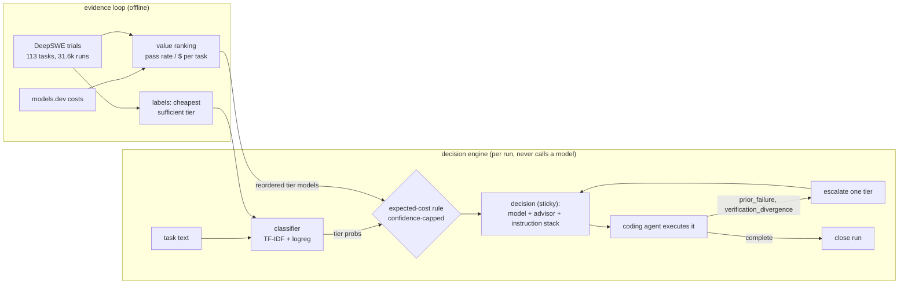

# model-router

Routing **decision engine** for a coding agent. Given a task it decides: tier, model, advisor
model, and the run's instruction stack. It never calls a model and never executes a task.

- **Tiers**: `utility` (fast/everyday) → `balanced` → `frontier`.
- **Sticky with escalation**: a run locks to one model; explicit signals move it up the ladder.
- **Advisor**: every decision includes one - explicit config, or the next tier up (`auto`).
- **Instruction stack**: base + tier directive + caller additions + escalation notes,
  accumulating per run like a regular session; the caller re-sends the whole stack.
- **Calibrated and evaluated** on [DeepSWE](https://deepswe.datacurve.ai/) public trial data
  (113 tasks, 31,617 trials).
- **Costs** from [models.dev](https://models.dev) (open, no key). Optional
  [Artificial Analysis](https://artificialanalysis.ai/data-api) free key adds benchmark
  indices (100 req/day, cached 7 days); without it, quality signal comes from DeepSWE outcomes.

## How it works



Short version:

1. `calibrate` labels each DeepSWE task with the cheapest tier that reliably solved
   it; those labels train the classifier.
2. `ranking.mode: "value"` reorders each tier by measured pass rate / measured $ per
   task (unmeasured models keep place; `"config"` disables).
3. `route` classifies the task, the expected-cost rule picks the start tier - objective
   mode `cost` | `balanced` | `quality` (`decision.mode`) - and the run locks (sticky).
4. Every decision returns model + advisor + accumulating instruction stack; the caller
   executes.
5. Failures escalate one tier and flag advisor review; `complete` ends the run.
6. `evaluate` replays held-out tasks as policies and reports $ per verified success.

## Quickstart

Stdlib only (Python >= 3.9). Cache lives in `~/.cache/model-router` (override with
`MODEL_ROUTER_CACHE`).

```bash
python3 -m model_router refresh      # models.dev catalog (+ AA indices if AA_API_KEY set)
python3 -m model_router calibrate    # train classifier on DeepSWE labels
python3 -m model_router evaluate     # held-out eval + policy simulation
python3 -m model_router route --run-id r1 --task "fix the pagination off-by-one"
```

Artificial Analysis key (optional, free tier - 100 req/day):

```bash
export AA_API_KEY=your-key           # or per call: model_router refresh --aa-key your-key
python3 -m model_router refresh      # fetches once, caches indices for 7 days
```

Keep the key in the environment, not in `config.json` - this repo is public.

Route a run:

```bash
python3 -m model_router route --run-id r1 --task "Fix the pagination helper." \
  --instruction "Keep the diff minimal."
python3 -m model_router route --run-id r1 --signal prior_failure     # escalates one tier
python3 -m model_router route --run-id r1 --signal needs_advisor    # advisor_required=true
python3 -m model_router route --run-id r1 --signal complete         # sticky run ends
```

Decision shape (trimmed):

```json
{
  "run_id": "r1", "turn": 2, "tier": "balanced",
  "model": "google/gemini-3.8-flash",
  "advisor": "openai/gpt-5.6-sol",
  "advisor_required": true, "advisor_reason": "escalation",
  "sticky": true, "escalated": true,
  "escalation_count": 1,
  "instructions": ["...base...", "...tier directive...", "Escalation: utility -> balanced. ..."],
  "rationale": {"classifier": "trained", "probs": {"utility": 0.99, "balanced": 0.01}}
}
```

Signals: `prior_failure`, `verification_divergence`
(escalate one tier), `not_understood`, `planning_needs_more_tools` (floor at balanced),
`needs_exploration` (floor at frontier), `needs_advisor`, `complete`. Any escalation also
sets `advisor_required` with `advisor_reason: "escalation"` - failure/divergence also
routes to advisor review.

## Where the defaults come from

`rank` joins models.dev prices with real DeepSWE pass rates (lab-direct refs resolved
from trial provider aliases):

```
model                     in$/M  out$/M  DeepSWE pass
zhipuai/glm-5.3-flash      0.15    0.50   63%
deepseek/deepseek-v4-flash 0.15    0.60   53%
google/gemini-3.8-flash    0.75    3.75   72%
openai/gpt-5.6-sol         4.00   20.00   64%
openai/gpt-6-astra        10.00   50.00   72%
```

Current tier combos (edit `config.json`):

| tier | models | advisor |
|---|---|---|
| utility | gpt-6-luna, deepseek-v4-flash, glm-5.3-flash, deepseek-v4.1-flash (OpenRouter - no lab-direct entry) | auto → balanced first |
| balanced | gpt-6.1-sol, gpt-6-sol, gemini-3.8-flash, glm-5.3 | auto → frontier first |
| frontier | gpt-5.6-sol, gpt-6-astra, claude-opus-5 | claude-fable-5-1 |

New-generation models with no DeepSWE trials yet (gpt-6-luna, gpt-6-sol/6.1-sol,
deepseek-v4.1-flash) show `-` in `rank`; the measured models behind them are the
evidence-backed fallbacks, and the policy simulation falls through to them automatically.

## Evaluation (held-out 34 tasks, real trial costs)

`evaluate` simulates policies with per-task measured cost and pass rates, escalation on
failure (a failed attempt pays for the next tier). Cost per verified success = mean
cost / mean pass rate.

| policy | cost/task | success | $/success |
|---|---|---|---|
| always-utility | $0.10 | 39.7% | **0.25** |
| always-balanced | $2.09 | 63.9% | 3.27 |
| always-frontier | $4.02 | 59.6% | 6.74 |
| balanced→frontier | $3.54 | 75.6% | 4.69 |
| utility→balanced→frontier | $2.42 | 79.5% | 3.04 |
| **router (this engine)** | **$2.42** | **79.5%** | **3.04** |

Findings, honestly:

- The tier **ladder** is where the value is: cheap first attempts + escalation give both
  lower cost and higher success than any single-tier policy.
- **Dynamic ranking** drives tier order from the evidence: deepseek-v4-flash leads
  utility (53% @ $0.10/task), gemini-3.8-flash balanced, gpt-6-astra frontier. Even so
  the router ties the best ladder policy ($3.04 per verified success); frontier picks
  sit within noise on 34 held-out tasks (astra vs gpt-5.6-sol differ by ~1pp).
- The text classifier alone is weak on DeepSWE (65.5% CV vs 85% majority baseline,
  labels: 96 utility / 17 balanced / 0 frontier). Its raw probabilities are overconfident,
  so `decision.confidence_cap` (0.9) prevents starts above utility unless the classifier is
  >94.4% sure - the mathematically correct point given the measured tier costs. Raise the
  cap to trust the classifier more, lower `cost_bands`/`tier_costs` to shift cheaper.
- Costs and effort settings are DeepSWE-specific. DeepSWE runs use max/high reasoning
  effort; the engine picks models, not effort - that stays a caller concern.
- `min_rate` 0.5 labels a task "tier sufficient" only when a model passed at least half
  its non-errored attempts; thin trial counts make labels noisy.

## Config reference (`config.json`)

```jsonc
{
  "tiers":      { "<tier>": { "models": [...], "directive": "..." } },
  "advisor":    { "<tier>": "auto" | "<provider/model>" },
  "ranking":    { "mode": "value" | "config" },        // value = order by measured pass/$ 
  "cost_bands": { "utility": 1.5, "balanced": 15.0 },   // $/M output -> tier fallback
  "decision":   { "mode": "cost" | "balanced" | "quality",   // objective preset
                  "rule": "expected_cost", "confidence_cap": 0.9,
                  "tier_costs": { "utility": 0.1, "balanced": 1.8, "frontier": 3.84 } },
  "classifier": { "frontier_prob": 0.45, "utility_prob": 0.55 },
  "instructions": { "base": "...", "escalation": "...", "advisor": "..." }
}
```

Library use:

```python
from model_router import Classifier, Router, RunStore, load_models

router = Router(config, load_models(cache_dir), Classifier.load(classifier_path),
                store=RunStore())            # or a directory to persist runs
d = router.decide("run-42", task_text)       # {model, advisor, instructions, ...}
# ... call d.model with d.instructions; on failure:
d = router.decide("run-42", signals={"prior_failure": True})
```

## Tests

```bash
python3 tests/test_engine.py    # stdlib unittest: sticky, escalation, advisor chain,
                                # instruction stack, classifier, label derivation
```

Data: DeepSWE public artifacts (`deepswe.datacurve.ai/artifacts/v1.1/`), models.dev
`api.json`. License: MIT.
