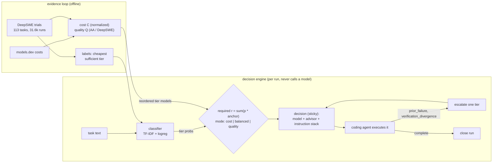

# model-router

Routing **decision engine** for a coding agent. Given a task it decides: tier, model, advisor
model, and the run's instruction stack. It never calls a model and never executes a task.

- **Tiers**: `utility` (fast/everyday) → `balanced` → `frontier`.
- **Sticky with escalation**: a run locks to one model; explicit signals move it up the ladder.
- **Advisor**: every decision includes one - explicit config, or the next tier up (`auto`).
- **Instruction stack**: base + tier directive + caller additions + escalation notes,
  accumulating per run like a regular session; the caller re-sends the whole stack.
- **Calibrated and evaluated** on [DeepSWE](https://deepswe.datacurve.ai/) public trial data
  (113 tasks, 31,617 trials).
- **Costs** from [models.dev](https://models.dev) (open, no key). Optional
  [Artificial Analysis](https://artificialanalysis.ai/data-api) free key adds benchmark
  indices (100 req/day, cached 7 days); without it, quality signal comes from DeepSWE outcomes.

## How it works



Short version:

1. `calibrate` labels each DeepSWE task with the cheapest tier that reliably solved
   it; those labels train the classifier, fit a probability temperature (raw probs are
   wildly overconfident), and derive tier anchors from data (median required Q per tier).
2. Every candidate model gets a **quality number Q** (0..1): Artificial Analysis
   index when a key is set (coding > agentic > intelligence), else DeepSWE pass rate.
   Cost C is the catalog price, normalized across candidates.
3. The task gets a **required number r**: `sum(tier prob * tier anchor)`. Anchor
   priority: config `decision.tier_requirement` > calibrated anchors > defaults.
   Feasible models are `Q >= r`.
4. `decision.mode` picks the start model - `cost`: cheapest feasible; `quality`: max Q;
   `balanced`: max arithmetic mean of Q and cost score `(Q + (1-C)) / 2` - and the run
   locks (sticky). Decisions also carry a reasoning `effort`: tier default (`utility`
   low, `balanced`/`frontier` medium), overridable per tier or per model in config.
5. Every decision returns model + effort + advisor + accumulating instruction stack;
   the caller executes.
6. Failures escalate one tier and flag advisor review; `complete` ends the run.
7. `evaluate` replays held-out tasks as policies and reports $ per verified success.

## Quickstart

Stdlib only (Python >= 3.9). Cache lives in `~/.cache/model-router` (override with
`MODEL_ROUTER_CACHE`).

```bash
python3 -m model_router refresh      # models.dev catalog (+ AA indices if AA_API_KEY set)
python3 -m model_router calibrate    # train classifier on DeepSWE labels
python3 -m model_router evaluate     # held-out eval + policy simulation
python3 -m model_router route --run-id r1 --task "fix the pagination off-by-one"
```

Artificial Analysis key (optional, free tier - 100 req/day):

```bash
export AA_API_KEY=your-key           # or put AA_API_KEY=... in a repo-root .env (gitignored)
python3 -m model_router refresh      # free language-models endpoint, ~4 requests, cached 7 days
```

The key feeds quality `Q` (coding index > agentic > intelligence) for ~680 matched models;
models without AA data fall back to DeepSWE pass rate. Keep the key out of `config.json`
and never commit `.env` - this repo is public.

Route a run:

```bash
python3 -m model_router route --run-id r1 --task "Fix the pagination helper." \
  --instruction "Keep the diff minimal."
python3 -m model_router route --run-id r1 --signal prior_failure     # escalates one tier
python3 -m model_router route --run-id r1 --message "still not working!!"  # frustration -> escalate + advisor
python3 -m model_router route --run-id r1 --signal tool_error_rate=0.5     # tool errors -> escalate
python3 -m model_router route --run-id r1 --signal needs_advisor    # advisor_required=true
python3 -m model_router route --run-id r1 --signal complete         # sticky run ends
```

Decision shape (trimmed):

```json
{
  "run_id": "r1",
  "turn": 2,
  "tier": "balanced",
  "model": "google/gemini-3.8-flash",
  "effort": "medium",
  "advisor": "openai/gpt-5.6-sol",
  "advisor_required": true,
  "advisor_reason": "escalation",
  "sticky": true,
  "escalated": true,
  "escalation_count": 1,
  "instructions": ["...base...", "...tier directive...", "Escalation: utility -> balanced. ..."],
  "rationale": {
    "classifier": "trained",
    "probs": { "utility": 0.99 },
    "mode": "cost",
    "required_quality": 0.35
  }
}
```

Objective modes (`decision.mode`), first principles - Q = model quality (AA index,
fallback DeepSWE pass), C = normalized price, r = task requirement:

| mode       | objective                                                                     |
| ---------- | ----------------------------------------------------------------------------- |
| `cost`     | cheapest model with `Q >= r` (if none, cheapest overall; escalate on failure) |
| `quality`  | max `Q` (needs AA key or DeepSWE coverage to mean anything)                   |
| `balanced` | max arithmetic mean `(Q + (1 - C)) / 2`                                       |

Signals: `prior_failure`, `verification_divergence`
(escalate one tier), `not_understood`, `planning_needs_more_tools` (floor at balanced),
`needs_exploration` (floor at frontier), `needs_advisor`, `complete`. Any escalation also
sets `advisor_required` with `advisor_reason: "escalation"` - failure/divergence also
routes to advisor review.

Numeric signals are optional and config-driven (`decision.signal_rules`, defaults):
`user_frustration` >= 0.5 escalates + flags advisor, `tool_error_rate` >= 0.3 escalates.
The CLI can score frustration from recent user messages: `--message "still not working!!"`.
At most one tier per decision - extra triggers flag advisor. Rules fire only when the
signal is passed; set `"enabled": false` or drop the rule to disable.

## Where the defaults come from

`rank` joins models.dev prices with real DeepSWE pass rates (lab-direct refs resolved
from trial provider aliases):

```
model                     in$/M  out$/M  DeepSWE pass
zhipuai/glm-5.3-flash      0.15    0.50   63%
deepseek/deepseek-v4-flash 0.15    0.60   53%
google/gemini-3.8-flash    0.75    3.75   72%
openai/gpt-5.6-sol         4.00   20.00   64%
openai/gpt-6-astra        10.00   50.00   72%
```

Current tier combos (edit `config.json`):

| tier     | models                                                                                               | advisor               |
| -------- | ---------------------------------------------------------------------------------------------------- | --------------------- |
| utility  | gpt-6-luna, deepseek-v4-flash, glm-5.3-flash, deepseek-v4.1-flash (OpenRouter - no lab-direct entry) | auto → balanced first |
| balanced | gpt-6.1-sol, gpt-6-sol, gemini-3.8-flash, glm-5.3                                                    | auto → frontier first |
| frontier | gpt-5.6-sol, gpt-6-astra, claude-opus-5                                                              | claude-fable-5-1      |

New-generation models with no DeepSWE trials yet (gpt-6-luna, gpt-6-sol/6.1-sol,
deepseek-v4.1-flash) show `-` in `rank`; the measured models behind them are the
evidence-backed fallbacks, and the policy simulation falls through to them automatically.

## Evaluation (held-out 34 tasks, real trial costs)

`evaluate` simulates policies with per-task measured cost and pass rates, escalation on
failure (a failed attempt pays for the next tier). Cost per verified success = mean
cost / mean pass rate.

| policy                    | cost/task | success   | $/success |
| ------------------------- | --------- | --------- | --------- |
| always-utility            | $0.10     | 39.7%     | **0.25**  |
| always-balanced           | $2.09     | 63.9%     | 3.27      |
| always-frontier           | $3.84     | 60.7%     | 6.32      |
| balanced→frontier         | $3.43     | 76.1%     | 4.51      |
| utility→balanced→frontier | $2.32     | 80.5%     | 2.88      |
| **router (this engine)**  | **$2.32** | **80.5%** | **2.88**  |

Findings, honestly:

- The tier **ladder** is where the value is: cheap first attempts + escalation give both
  lower cost and higher success than any single-tier policy.
- **Modes** score every candidate: `cost` picks the cheapest feasible (gpt-6-luna leads
  utility today), `quality` picks max AA/DeepSWE quality, `balanced` maximizes the
  arithmetic mean of quality and cost score. The router ties the best ladder policy
  ($2.88 per verified success).
- The text classifier is weak on DeepSWE (65.5% CV vs 85% majority baseline,
  labels: 96 utility / 17 balanced / 0 frontier), but it is now calibrated: `calibrate`
  fits a temperature (currently 8.0 - raw probabilities were extremely overconfident,
  NLL 2.35 -> 1.21) and derives tier anchors from data (utility 0.608, balanced 0.688).
  Combined with the quality gate this lifted the routed choice's pass rate from 39.7%
  to **57.6%** on held-out tasks, with 8/34 failing outright.
- Reasoning `effort` is part of every decision: low for utility, medium for
  balanced/frontier, overridable per tier or per model. Benchmark runs used max effort;
  production defaults stay cost-conscious.
- `min_rate` 0.5 labels a task "tier sufficient" only when a model passed at least half
  its non-errored attempts; thin trial counts make labels noisy.

## Config reference (`config.json`)

```jsonc
{
  "tiers":      { "<tier>": { "models": [...], "directive": "..." } },
  "advisor":    { "<tier>": "auto" | "<provider/model>" },
  "cost_bands": { "utility": 1.5, "balanced": 15.0 },   // $/M output -> tier fallback
  "decision":   { "mode": "cost" | "balanced" | "quality",
                  "tier_requirement": { "utility": 0.35, "balanced": 0.6, "frontier": 0.8 },  // optional; calibrated anchors win if absent
                  "signal_rules": { "user_frustration": { "threshold": 0.5, "action": "escalate_advise" },
                                    "tool_error_rate": { "threshold": 0.3, "action": "escalate" } } },
  "efforts":    { "utility": "low", "balanced": "medium", "frontier": "medium" },  // per tier or "<provider/model>"
  "classifier": { "frontier_prob": 0.45, "utility_prob": 0.55 },
  "instructions": { "base": "...", "escalation": "...", "advisor": "..." }
}
```

Library use (pass `quality` for mode scoring - AA indices preferred, DeepSWE pass fallback -
and `anchors` from the calibrate cache if present):

```python
from model_router import Classifier, Router, RunStore, load_models

router = Router(config, load_models(cache_dir), Classifier.load(classifier_path),
                store=RunStore(), quality=quality_map, anchors=anchors)   # ref -> 0..1
d = router.decide("run-42", task_text)       # {model, effort, advisor, instructions, ...}
# ... call d.model at d.effort with d.instructions; on failure:
d = router.decide("run-42", signals={"prior_failure": True})
```

## Tests

```bash
python3 tests/test_engine.py    # stdlib unittest: sticky, escalation, advisor chain,
                                # instruction stack, classifier, label derivation
```

Data: DeepSWE public artifacts (`deepswe.datacurve.ai/artifacts/v1.1/`), models.dev
`api.json`. License: MIT.
